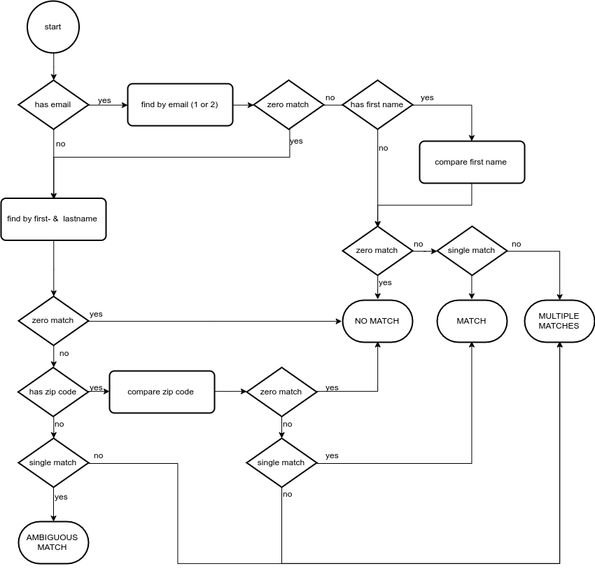

# API Documentation
## Authentication
### Obtain Access Token
The API is secured with OAuth2. Use the client credentials flow to authenticate yourself.
To do so send a `POST` request to the `/oauth/token` endpoint containing the following
data (replace the `%values%` with your credentials).
```JSON
{
  "grant_type"    : "client_credentials",
  "client_id"     : "%client-id%",
  "client_secret" : "%client-secret%",
  "scope"         : ""
}
```
The Webling Service will respond with the access token. You may now access the
protected api endpoints adding the token to your request header. The header field
must satisfy the following form.
```
Authorization: Bearer %token%
```

### Test Access Token
Request:
```
GET api/v1/auth
```

Response:

```
Status code: 200

Body: success
```

## Member

Read the full [list](https://raw.githubusercontent.com/grueneschweiz/weblingservice/master/config/webling-field-mappings.yml) of all member properties and its possible values. 
The `id` property is read only.

Field update modes:
* `replace` replaces the current value
* `append` appends the given value to the current value. Doesn't work for fields of type `DateField` and `SelectField`
* `remove` removes the given value from the current value. Doesn't work for fields of type `DateField` and `SelectField`
* `replaceEmpty` adds the given value only if the field is empty
* `addIfNew` adds the given value only if this is a new record

On any field, a single action or multiple actions may be performed.
* Single action example
    ```json
    {
        "interests": 
        {
            "value": "energy", 
            "mode": "append"
        }
    }
    ```
  This will add the `energy` interest flag without changing any other flags.

  
* Multi action example: 
  ```json
  {
      "interests":
      [
          {
              "value": "climate", 
              "mode": "append"
          },
          {
              "value": "agriculture", 
              "mode": "remove"
          }
      ]
  }
  ``` 
  This will add the `climate` interest flag and remove the `agriculture` flag
  but wont affect any other flags. 


### Show single
#### Regular request
Request:
```
GET api/v1/member/{id}
```

Response:
```
Status code: 200

Body:
{
    "email1": "mail@example.com",
    "firstName": "Hugo",
    "lastName": "Der Testmann",
    "gender": "n",
    "recordCategory": "private",
    "emailStatus": "active",
    "language": null,
    "newsletterCountryD": null,
    "newsletterCountryF": null,
    "newsletterMunicipality": null,
    "newsletterOther": null,
    "pressReleaseCountryD": null,
    "pressReleaseCountryF": null,
    "memberStatusCountry": null,
    "interests": [],
    "donorCountry": null,
    "notesCountry": null,
    "recordStatus": "active",
    "id": 30361,
    "groups": [
        201
    ],
    "firstLevelGroupNames": "CH"
}
```

#### Admin request

Request:
```
GET api/v1/member/{id}
```

Response:
```
Status code: 200

Body:
{
    "company": null,
    "firstName": "Hugo",
    "lastName": "Der Testmann",
    "recordCategory": "private",
    "recordStatus": "active",
    "language": "d",
    "gender": "m",
    "salutationFormal": "mD",
    "salutationInformal": "mD",
    "title": null,
    "address1": null,
    "address2": null,
    "zip": null,
    "city": null,
    "country": "ch",
    "postStatus": "active",
    "email1": "hugo.dertestmann@gmail.com",
    "email2": null,
    "emailStatus": "active",
    "mobilePhone": null,
    "landlinePhone": null,
    "workPhone": null,
    "phoneStatus": "active",
    "birthday": null,
    "website": null,
    "facebook": null,
    "twitter": null,
    "iban": null,
    "coupleCategory": "single",
    "partnerSalutationFormal": null,
    "partnerSalutationInformal": null,
    "partnerFirstName": null,
    "partnerLastName": null,
    "magazineCountryD": null,
    "magazineCountryF": null,
    "magazineCantonD": null,
    "magazineCantonF": null,
    "magazineMunicipality": null,
    "magazineOther": null,
    "newsletterCountryD": null,
    "newsletterCountryF": null,
    "newsletterCantonD": null,
    "newsletterCantonF": null,
    "newsletterMunicipality": null,
    "newsletterOther": null,
    "pressReleaseCountryD": null,
    "pressReleaseCountryF": null,
    "pressReleaseCantonD": null,
    "pressReleaseCantonF": null,
    "pressReleaseMunicipality": null,
    "memberStatusCountry": null,
    "memberStatusCanton": null,
    "memberStatusRegion": null,
    "memberStatusMunicipality": null,
    "memberStatusYoung": null,
    "responsibility": null,
    "entryChannel": null,
    "membershipStart": null,
    "membershipEnd": null,
    "membershipFeeCountry": null,
    "membershipFeeCanton": null,
    "membershipFeeRegion": null,
    "membershipFeeMunicipality": null,
    "membershipFeeYoung": null,
    "interests": [],
    "roleCountry": null,
    "roleCanton": null,
    "roleRegion": null,
    "roleMunicipality": null,
    "roleYoung": null,
    "roleInternational": null,
    "request": [],
    "profession": null,
    "professionCategory": null,
    "networkNpo": null,
    "networkOther": null,
    "mandateCountry": [],
    "mandateCountryDetail": null,
    "mandateCanton": [],
    "mandateCantonDetail": null,
    "mandateRegion": [],
    "mandateRegionDetail": null,
    "mandateMunicipality": [],
    "mandateMunicipalityDetail": null,
    "donorCountry": null,
    "donorCanton": null,
    "donorRegion": null,
    "donorMunicipality": null,
    "donorYoung": null,
    "notesCountry": null,
    "notesCanton": null,
    "notesMunicipality": null,
    "legacy": null,
    "id": 30361,
    "groups": [
        201
    ],
    "firstLevelGroupNames": "CH"
}
```

### Update

Request:
```
PUT api/v1/member/{id}

Body:
{
    "email1": 
    {
        "value": "new@example.com",
        "mode": "replace"
    },
    "newsletterCountryD":
    {
        "value": "yes",
        "mode": "replaceEmpty"
    },
    "entryChannel":
    {
        "value": "gruene.ch",
        "mode": "addIfNew"
    },
    "notesCountry": 
    [
        {
          "value": "aNewTag", 
          "mode": "append"
        },
        {
          "value": "anOldTag", 
          "mode": "remove"
        }
    ],
    "groups":
    {
        "value": [201, 202],
        "mode": "append"
    }
}

```

Response:
```
Status code: 201

Body: 30361
```
The body contains the `id` of the new record.


### Upsert
This uses the [matching](#matching) algorithm internally to determine, if the record does
already exist. If we get a *match* the record is updated. For *no_match*, *multiple*
and *ambiguous* matches a new record is created.

Request:
```
POST api/v1/member

Body:
{
    "email1": 
    {
        "value": "new@example.com",
        "mode": "replace"
    },
    "newsletterCountryD":
    {
        "value": "yes",
        "mode": "replaceEmpty"
    },
    "entryChannel":
    {
        "value": "gruene.ch",
        "mode": "addIfNew"
    },
    "notesCountry": 
    [
        {
          "value": "aNewTag", 
          "mode": "append"
        },
        {
          "value": "anOldTag", 
          "mode": "remove"
        }
    ],
    "groups":
    {
        "value": [201, 202],
        "mode": "append"
    }
}

```

Response:
```
Status code: 201

Body: 30361
```
The body contains the `id` of the matching or the new record. The status code is 201 regardless
of whether the item was inserted or updated.


### <a name="matching"></a> Find matching records
Using a given member, this endpoint searches the database using the following algorithm to 
determine, if the member is already in the database.


You may optionally specify which `groups` should be searched by specifying their ids (as a
comma separated list). If no group ids are given, the whole database is searched.  

Match statuses:
* `no_match` no similar record found at all
* `match` single non ambiguous match
* `ambiguous` single match, but there is a high probability of collision, since there were not
enough properties for an unmistakable match
* `multiple` we found multiple records that match

Request:
```
POST api/v1/member/match/{groups?}

Body:
{
    "email1": 
    {
        "value": "new@example.com"
    },
    "firstName": 
    {
        "value": "Maria"
    },
    "lastName": 
    {
        "value": "Muster"
    },
    "zip": 
    {
        "value": "8005"
    }
}

```

Response:
```
Status code: 200

Body:
{
    "status": "match",
    "matches": [
        {
            "email1": "new@example.com",
            "firstName": "Maria",
            "lastName": "Muster",
            "gender": null,
            "recordCategory": "private",
            "emailStatus": "active",
            "language": null,
            "newsletterCountryD": "yes",
            "newsletterCountryF": null,
            "newsletterMunicipality": null,
            "newsletterOther": null,
            "pressReleaseCountryD": null,
            "pressReleaseCountryF": null,
            "memberStatusCountry": null,
            "interests": [],
            "donorCountry": null,
            "notesCountry": "SomeTag",
            "recordStatus": "active",
            "id": 30361,
            "groups": [
                201,
                202
            ],
            "firstLevelGroupNames": "ZH"
        }
    ]
}
```


### Find main record

Try to find the most important record of the given member. If only one exists, this is, of 
course, the most important member. If we have multiple matches (see [matching](#matching) for
details), these are rated according to the membership fields. The one with the highest rating
is considered as the main member. If we have multiple winners, the first one is taken. 

> **The rating in detail**:
<br> Look at the five member fields (`memberStatusCountry`, `memberStatusCanton`, `memberStatusRegion`,
`memberStatusMunicipality`, `memberStatusYoung`) and value the `member` status with 11, `unconfirmed`
with 6 and `sympathizer` with 1. The rating is the sum of those values.
<br> The weights of 11, 6 and 1 assure that one member status always wins over five sympathizer status
and one unconfirmed status wins over five sympathizer status as well. Moreover one member status will
dominate one unconfirmed and four sympathizer status.


You may optionally specify which `groups` should be searched by specifying their ids (as a
comma separated list). If no group ids are given, the whole database is searched.

Request:
```
GET api/v1/member/{id}/main/{groups?}
```

Response:
```
Status code: 200

Body:
{
    "email1": "new@example.com",
    "firstName": "Hugo",
    "lastName": "Der Testmann",
    "gender": null,
    "recordCategory": "private",
    "emailStatus": "active",
    "language": null,
    "newsletterCountryD": "yes",
    "newsletterCountryF": null,
    "newsletterMunicipality": null,
    "newsletterOther": null,
    "pressReleaseCountryD": null,
    "pressReleaseCountryF": null,
    "memberStatusCountry": null,
    "interests": [],
    "donorCountry": null,
    "notesCountry": "SomeTag",
    "recordStatus": "active",
    "id": 30361,
    "groups": [
        201,
        202
    ],
    "firstLevelGroupNames": "ZH"
}
```


### Get changes

Retrieve changes since the given `revisionId`. Call the [revision](#get-revision) endpoint
to get the current revision id.

Since revisions may contain many records, use the `limit` and the `offset` parameters for 
pagination.

Request:
```
GET api/v1/member/changed/{revisionId}/{limit?}/{offset?}
```

Response:
```
Status code: 200

Body:
{
    "22040": null,
    "30361": {
        "email1": "new@example.com",
        "firstName": "Hugo",
        "lastName": "Der Testmann",
        "gender": null,
        "recordCategory": "private",
        "emailStatus": "active",
        "language": null,
        "newsletterCountryD": "yes",
        "newsletterCountryF": null,
        "newsletterMunicipality": null,
        "newsletterOther": null,
        "pressReleaseCountryD": null,
        "pressReleaseCountryF": null,
        "memberStatusCountry": null,
        "interests": [],
        "donorCountry": null,
        "notesCountry": "SomeTag",
        "recordStatus": "active",
        "id": 30361,
        "groups": [
            201,
            202
        ],
        "firstLevelGroupNames": "ZH"
    }
}
```

If the response only contains a key with a null value, this means, that the record with the
id of the key was deleted.


## Revision
### <a name="get-revision"></a>Get current revision

Request:
```
GET api/v1/revision
```

Response:
```
Status code: 200

Body: 69986
```
The response body contains the current revision id.

## Group
### Show single group
Request:
```
GET api/v1/group/{id}
```

Response:
```
Status code: 200

Body:
{
    "id": 203,
    "name": "Stadt Zürich (Bezirk)",
    "parent": 202,
    "children": [
        205,
        206
    ],
    "members": [
        224,
        287,
        288
    ],
    "rootPath": [
        100,
        202
    ]
}
```